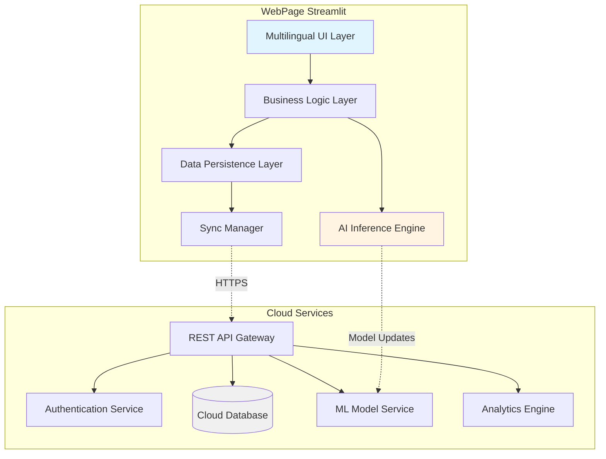

# Design Document: SwasthyaAI Platform

## Overview

SwasthyaAI is a mobile-first clinical decision support platform architected for resource-constrained rural healthcare environments. The system employs a hybrid architecture combining on-device AI inference for offline capability with cloud-based services for data synchronization, advanced analytics, and model updates.

The platform is designed around three core principles:

1. **Offline-First**: All critical functionality (data collection, risk assessment, record viewing) operates without network connectivity
2. **Progressive Enhancement**: Advanced features (image analysis, cloud-based models, analytics) activate when resources permit
3. **Simplicity**: Interface and workflows optimized for users with minimal technical training

The system targets Android devices (API level 24+) to maximize compatibility with low-cost smartphones prevalent in rural India. The architecture separates concerns into distinct layers: presentation (multilingual UI), business logic (clinical protocols, risk assessment), data persistence (local SQLite with cloud sync), and AI inference (on-device TensorFlow Lite models).

## Architecture

### System Architecture



### Component Architecture

The platform consists of the following major components:

**WebPage Components:**
- **UI Layer**: Streamlit for scalable infrastructure and easy deploymen cross-platform consistency with native performance
- **Local Database**: SQLite for structured data storage with full-text search capability
- **Sync Engine**: Background service managing bidirectional data synchronization with conflict resolution
- **AI Inference Engine**: TensorFlow Lite runtime executing quantized models for risk assessment
- **Media Handler**: Image capture, compression, and quality validation
- **Language Manager**: i18n framework supporting 5+ Indian languages with RTL support where needed

**Cloud Services Components:**
- **API Gateway**: RESTful API with rate limiting and request validation
- **Authentication Service**: JWT-based authentication with role-based access control
- **Cloud Database**: PostgreSQL for relational data with PostGIS for geographic queries
- **ML Model Service**: Model versioning, A/B testing, and distribution
- **Analytics Engine**: Apache Spark or similar for aggregated health trend analysis
- **Notification Service**: Push notifications for critical alerts and sync status

### Data Flow

**Screening Session Flow:**
1. Health worker authenticates (cached credentials work offline)
2. Patient search/registration (local database, syncs later if offline)
3. Symptom collection (stored locally immediately)
4. Vital signs recording (stored locally immediately)
5. Optional image capture (stored locally, queued for upload)
6. Risk score calculation (on-device AI model)
7. Results display with confidence levels
8. Referral generation if needed
9. Session saved to local database
10. Background sync when connectivity available

**Synchronization Flow:**
1. Sync manager detects connectivity
2. Authenticate with cloud services
3. Pull server changes (new patients, updated records from other workers)
4. Resolve conflicts (last-write-wins with audit trail)
5. Push local changes (new sessions, updated records)
6. Prioritize high-risk patient data
7. Update sync status and timestamps
8. Download model updates if available

## Components and Interfaces

### Patient Management Component

**Responsibilities:**
- Patient registration and unique ID generation
- Patient search and retrieval
- Duplicate detection and merging
- Patient demographic management

**Interfaces:**

```typescript
interface PatientManager {
  // Create new patient record
  createPatient(demographics: PatientDemographics): Promise<Patient>
  
  // Search for existing patients
  searchPatients(query: SearchQuery): Promise<Patient[]>
  
  // Retrieve patient by ID
  getPatient(patientId: string): Promise<Patient | null>
  
  // Update patient information
  updatePatient(patientId: string, updates: Partial<PatientDemographics>): Promise<Patient>
  
  // Find potential duplicates
  findDuplicates(patient: Patient): Promise<Patient[]>
}

interface PatientDemographics {
  name: string
  age?: number
  ageApproximate: boolean
  gender: 'male' | 'female' | 'other'
  village: string
  contactNumber?: string
  guardianName?: string
}

interface Patient {
  id: string
  demographics: PatientDemographics
  createdAt: Date
  updatedAt: Date
  createdBy: string
  lastScreeningDate?: Date
}
```

### Symptom Collection Component

**Responsibilities:**
- Present symptom selection interface
- Manage symptom hierarchies and follow-up questions
- Support multilingual symptom terminology
- Validate and structure symptom data

**Interfaces:**

```typescript
interface SymptomCollector {
  // Get symptom categories for initial selection
  getSymptomCategories(language: Language): SymptomCategory[]
  
  // Get follow-up questions based on selected symptom
  getFollowUpQuestions(symptomId: string, language: Language): Question[]
  
  // Record symptom with responses
  recordSymptom(symptom: SymptomRecord): void
  
  // Get all recorded symptoms for current session
  getRecordedSymptoms(): SymptomRecord[]
}

interface SymptomCategory {
  id: string
  name: LocalizedString
  symptoms: Symptom[]
}

interface Symptom {
  id: string
  name: LocalizedString
  followUpQuestions: string[]
}

interface SymptomRecord {
  symptomId: string
  duration: Duration
  severity?: 'mild' | 'moderate' | 'severe'
  responses: Record<string, any>
  freeText?: string
}

interface Duration {
  value: number
  unit: 'days' | 'weeks' | 'months'
  approximate: boolean
}
```

### Vital Signs Component

**Responsibilities:**
- Record vital sign measurements
- Validate physiological ranges
- Flag abnormal values
- Track measurement history

**Interfaces:**

```typescript
interface VitalSignsRecorder {
  // Record vital signs for current session
  recordVitalSigns(vitals: VitalSigns): ValidationResult
  
  // Get vital signs history for patient
  getVitalSignsHistory(patientId: string, limit?: number): VitalSigns[]
  
  // Validate vital signs values
  validateVitalSigns(vitals: VitalSigns): ValidationResult
}

interface VitalSigns {
  temperature?: number  // Celsius
  bloodPressureSystolic?: number  // mmHg
  bloodPressureDiastolic?: number  // mmHg
  pulseRate?: number  // bpm
  respiratoryRate?: number  // breaths per minute
  oxygenSaturation?: number  // percentage
  weight?: number  // kg
  height?: number  // cm
  timestamp: Date
}

interface ValidationResult {
  valid: boolean
  warnings: VitalSignWarning[]
}

interface VitalSignWarning {
  field: keyof VitalSigns
  value: number
  normalRange: { min: number; max: number }
  severity: 'info' | 'warning' | 'critical'
}
```

### Image Screening Component

**Responsibilities:**
- Capture medical images
- Assess image quality
- Compress images for storage/transmission
- Queue images for analysis

**Interfaces:**

```typescript
interface ImageScreening {
  // Capture image with quality validation
  captureImage(type: ImageType): Promise<CapturedImage>
  
  // Assess image quality
  assessQuality(image: CapturedImage): QualityAssessment
  
  // Queue image for analysis
  queueForAnalysis(image: CapturedImage): Promise<string>
  
  // Get analysis results if available
  getAnalysisResult(imageId: string): Promise<ImageAnalysisResult | null>
}

interface CapturedImage {
  id: string
  type: ImageType
  data: Blob
  timestamp: Date
  metadata: ImageMetadata
}

type ImageType = 'skin_lesion' | 'eye' | 'throat' | 'other'

interface ImageMetadata {
  resolution: { width: number; height: number }
  fileSize: number
  format: string
}

interface QualityAssessment {
  acceptable: boolean
  issues: QualityIssue[]
  score: number  // 0-100
}

interface QualityIssue {
  type: 'blur' | 'lighting' | 'framing' | 'resolution'
  severity: 'minor' | 'major'
  suggestion: LocalizedString
}

interface ImageAnalysisResult {
  imageId: string
  findings: string[]
  confidence: number
  processedAt: Date
}
```

### Risk Assessment Engine

**Responsibilities:**
- Execute AI models for disease risk prediction
- Calculate confidence levels
- Generate explanations for risk scores
- Manage model versions

**Interfaces:**

```typescript
interface RiskAssessmentEngine {
  // Calculate risk scores for current session data
  assessRisk(sessionData: ScreeningSessionData): Promise<RiskAssessment>
  
  // Get available disease models
  getAvailableModels(): DiseaseModel[]
  
  // Update models from cloud
  updateModels(): Promise<ModelUpdateResult>
}

interface ScreeningSessionData {
  patientId: string
  symptoms: SymptomRecord[]
  vitalSigns?: VitalSigns
  images?: CapturedImage[]
  patientHistory?: ScreeningSession[]
}

interface RiskAssessment {
  sessionId: string
  timestamp: Date
  scores: RiskScore[]
  overallConfidence: ConfidenceLevel
}

interface RiskScore {
  disease: string
  probability: number  // 0-1
  confidence: ConfidenceLevel
  contributingFactors: Factor[]
  explanation: LocalizedString
}

type ConfidenceLevel = 'high' | 'medium' | 'low'

interface Factor {
  type: 'symptom' | 'vital' | 'history' | 'demographic'
  name: string
  impact: 'positive' | 'negative'
  weight: number
}

interface DiseaseModel {
  id: string
  disease: string
  version: string
  accuracy: number
  lastUpdated: Date
}
```

### Health Record Manager

**Responsibilities:**
- Store and retrieve screening sessions
- Manage patient health history
- Track trends over time
- Support notes and annotations

**Interfaces:**

```typescript
interface HealthRecordManager {
  // Save completed screening session
  saveSession(session: ScreeningSession): Promise<string>
  
  // Get patient's screening history
  getPatientHistory(patientId: string, options?: HistoryOptions): Promise<ScreeningSession[]>
  
  // Get specific session
  getSession(sessionId: string): Promise<ScreeningSession | null>
  
  // Add note to patient record
  addNote(patientId: string, note: Note): Promise<void>
  
  // Get health trends
  getTrends(patientId: string, metric: TrendMetric): Promise<TrendData>
}

interface ScreeningSession {
  id: string
  patientId: string
  healthWorkerId: string
  timestamp: Date
  symptoms: SymptomRecord[]
  vitalSigns?: VitalSigns
  images?: CapturedImage[]
  riskAssessment: RiskAssessment
  referral?: Referral
  notes?: Note[]
  syncStatus: 'pending' | 'synced' | 'conflict'
}

interface HistoryOptions {
  limit?: number
  startDate?: Date
  endDate?: Date
  includeNotes?: boolean
}

interface Note {
  id: string
  text: string
  authorId: string
  timestamp: Date
  language: Language
}

type TrendMetric = 'blood_pressure' | 'weight' | 'risk_score'

interface TrendData {
  metric: TrendMetric
  dataPoints: DataPoint[]
  trend: 'improving' | 'stable' | 'worsening'
}

interface DataPoint {
  date: Date
  value: number
}
```

### Referral Manager

**Responsibilities:**
- Generate referral recommendations
- Determine urgency levels
- Create referral documents
- Track referral outcomes

**Interfaces:**

```typescript
interface ReferralManager {
  // Generate referral recommendation based on risk assessment
  generateReferral(assessment: RiskAssessment, sessionData: ScreeningSessionData): Referral | null
  
  // Create referral document for sharing
  createReferralDocument(referral: Referral): Promise<ReferralDocument>
  
  // Mark referral as completed
  completeReferral(referralId: string, outcome: ReferralOutcome): Promise<void>
  
  // Get pending referrals for health worker
  getPendingReferrals(healthWorkerId: string): Promise<Referral[]>
}

interface Referral {
  id: string
  patientId: string
  sessionId: string
  urgency: 'immediate' | 'within_24h' | 'within_week' | 'routine'
  reason: LocalizedString
  recommendedFacility: 'PHC' | 'district_hospital' | 'specialist'
  diseases: string[]
  createdAt: Date
  status: 'pending' | 'completed' | 'cancelled'
}

interface ReferralDocument {
  referralId: string
  patientSummary: string
  symptoms: string
  vitalSigns: string
  riskScores: string
  recommendations: string
  format: 'pdf' | 'text'
  data: Blob | string
}

interface ReferralOutcome {
  completedAt: Date
  facilityVisited: string
  diagnosis?: string
  treatment?: string
  followUpRequired: boolean
}
```

### Synchronization Manager

**Responsibilities:**
- Detect connectivity status
- Manage bidirectional sync
- Resolve conflicts
- Prioritize sync operations

**Interfaces:**

```typescript
interface SynchronizationManager {
  // Start sync process
  sync(): Promise<SyncResult>
  
  // Get sync status
  getSyncStatus(): SyncStatus
  
  // Register sync listener
  onSyncStatusChange(callback: (status: SyncStatus) => void): void
  
  // Resolve sync conflict
  resolveConflict(conflictId: string, resolution: ConflictResolution): Promise<void>
}

interface SyncResult {
  success: boolean
  recordsSynced: number
  conflicts: SyncConflict[]
  errors: SyncError[]
  timestamp: Date
}

interface SyncStatus {
  isOnline: boolean
  isSyncing: boolean
  lastSyncTime?: Date
  pendingRecords: number
  pendingConflicts: number
}

interface SyncConflict {
  id: string
  recordType: 'patient' | 'session' | 'note'
  recordId: string
  localVersion: any
  serverVersion: any
  timestamp: Date
}

interface ConflictResolution {
  strategy: 'use_local' | 'use_server' | 'merge'
  mergedData?: any
}

interface SyncError {
  recordId: string
  error: string
  retryable: boolean
}
```

### Analytics Component

**Responsibilities:**
- Aggregate health data across coverage area
- Generate reports and visualizations
- Identify health trends
- Support data export

**Interfaces:**

```typescript
interface AnalyticsEngine {
  // Get summary statistics for coverage area
  getSummaryStats(area: CoverageArea, period: TimePeriod): Promise<HealthStats>
  
  // Get disease prevalence trends
  getPrevalenceTrends(disease: string, area: CoverageArea, period: TimePeriod): Promise<TrendData>
  
  // Identify high-risk areas
  getHighRiskAreas(disease: string, threshold: number): Promise<RiskArea[]>
  
  // Export report
  exportReport(reportType: ReportType, options: ReportOptions): Promise<Blob>
}

interface CoverageArea {
  type: 'village' | 'phc' | 'district'
  id: string
  name: string
}

interface TimePeriod {
  start: Date
  end: Date
}

interface HealthStats {
  totalScreenings: number
  uniquePatients: number
  highRiskCases: number
  referralsMade: number
  diseaseBreakdown: Record<string, number>
  averageConfidence: number
}

interface RiskArea {
  area: CoverageArea
  riskScore: number
  caseCount: number
  prevalenceRate: number
}

type ReportType = 'summary' | 'disease_specific' | 'referral_tracking' | 'coverage'

interface ReportOptions {
  area: CoverageArea
  period: TimePeriod
  format: 'pdf' | 'csv' | 'json'
  includeCharts: boolean
}
```

## Data Models

### Core Data Models

**Patient Model:**
```typescript
interface Patient {
  id: string  // UUID
  demographics: {
    name: string
    age?: number
    ageApproximate: boolean
    gender: 'male' | 'female' | 'other'
    village: string
    contactNumber?: string
    guardianName?: string
  }
  metadata: {
    createdAt: Date
    updatedAt: Date
    createdBy: string  // Health worker ID
    lastScreeningDate?: Date
    totalScreenings: number
  }
  syncMetadata: {
    localId: string
    serverId?: string
    lastSyncedAt?: Date
    version: number
  }
}
```

**Screening Session Model:**
```typescript
interface ScreeningSession {
  id: string  // UUID
  patientId: string
  healthWorkerId: string
  timestamp: Date
  
  // Clinical data
  symptoms: SymptomRecord[]
  vitalSigns?: VitalSigns
  images?: {
    id: string
    type: ImageType
    localPath: string
    cloudUrl?: string
    uploaded: boolean
  }[]
  
  // Assessment results
  riskAssessment: {
    scores: RiskScore[]
    overallConfidence: ConfidenceLevel
    modelVersions: Record<string, string>
  }
  
  // Actions taken
  referral?: Referral
  notes?: Note[]
  
  // Metadata
  duration: number  // seconds
  location?: {
    latitude: number
    longitude: number
  }
  
  // Sync metadata
  syncStatus: 'pending' | 'synced' | 'conflict'
  syncMetadata: {
    localId: string
    serverId?: string
    lastSyncedAt?: Date
    version: number
  }
}
```

**Health Worker Model:**
```typescript
interface HealthWorker {
  id: string
  name: string
  role: 'asha' | 'phc_staff' | 'admin'
  credentials: {
    username: string
    passwordHash: string
    lastPasswordChange: Date
  }
  profile: {
    phoneNumber: string
    email?: string
    languagePreference: Language
    coverageArea: CoverageArea
  }
  permissions: {
    canViewAnalytics: boolean
    canExportData: boolean
    canManageUsers: boolean
  }
  metadata: {
    createdAt: Date
    lastLoginAt?: Date
    totalScreenings: number
  }
}
```

### Database Schema

**Local SQLite Schema:**

```sql
-- Patients table
CREATE TABLE patients (
  id TEXT PRIMARY KEY,
  name TEXT NOT NULL,
  age INTEGER,
  age_approximate INTEGER DEFAULT 1,
  gender TEXT CHECK(gender IN ('male', 'female', 'other')),
  village TEXT NOT NULL,
  contact_number TEXT,
  guardian_name TEXT,
  created_at INTEGER NOT NULL,
  updated_at INTEGER NOT NULL,
  created_by TEXT NOT NULL,
  last_screening_date INTEGER,
  total_screenings INTEGER DEFAULT 0,
  server_id TEXT,
  last_synced_at INTEGER,
  version INTEGER DEFAULT 1,
  sync_status TEXT DEFAULT 'pending'
);

CREATE INDEX idx_patients_name ON patients(name);
CREATE INDEX idx_patients_village ON patients(village);
CREATE INDEX idx_patients_sync_status ON patients(sync_status);

-- Screening sessions table
CREATE TABLE screening_sessions (
  id TEXT PRIMARY KEY,
  patient_id TEXT NOT NULL,
  health_worker_id TEXT NOT NULL,
  timestamp INTEGER NOT NULL,
  symptoms_json TEXT NOT NULL,
  vital_signs_json TEXT,
  risk_assessment_json TEXT NOT NULL,
  referral_json TEXT,
  notes_json TEXT,
  duration INTEGER,
  latitude REAL,
  longitude REAL,
  server_id TEXT,
  last_synced_at INTEGER,
  version INTEGER DEFAULT 1,
  sync_status TEXT DEFAULT 'pending',
  FOREIGN KEY (patient_id) REFERENCES patients(id)
);

CREATE INDEX idx_sessions_patient ON screening_sessions(patient_id);
CREATE INDEX idx_sessions_timestamp ON screening_sessions(timestamp);
CREATE INDEX idx_sessions_sync_status ON screening_sessions(sync_status);

-- Images table
CREATE TABLE images (
  id TEXT PRIMARY KEY,
  session_id TEXT NOT NULL,
  type TEXT NOT NULL,
  local_path TEXT NOT NULL,
  cloud_url TEXT,
  uploaded INTEGER DEFAULT 0,
  file_size INTEGER,
  timestamp INTEGER NOT NULL,
  FOREIGN KEY (session_id) REFERENCES screening_sessions(id)
);

CREATE INDEX idx_images_session ON images(session_id);
CREATE INDEX idx_images_uploaded ON images(uploaded);

-- Health workers table
CREATE TABLE health_workers (
  id TEXT PRIMARY KEY,
  name TEXT NOT NULL,
  role TEXT NOT NULL,
  username TEXT UNIQUE NOT NULL,
  password_hash TEXT NOT NULL,
  phone_number TEXT,
  email TEXT,
  language_preference TEXT DEFAULT 'en',
  coverage_area_json TEXT,
  permissions_json TEXT,
  created_at INTEGER NOT NULL,
  last_login_at INTEGER
);

-- Sync conflicts table
CREATE TABLE sync_conflicts (
  id TEXT PRIMARY KEY,
  record_type TEXT NOT NULL,
  record_id TEXT NOT NULL,
  local_version_json TEXT NOT NULL,
  server_version_json TEXT NOT NULL,
  timestamp INTEGER NOT NULL,
  resolved INTEGER DEFAULT 0
);
```

**Cloud PostgreSQL Schema:**

```sql
-- Similar structure with additional tables for:
-- - Audit logs
-- - Model versions
-- - Analytics aggregations
-- - User sessions
-- - System configuration
```

## Correctness Properties

*A property is a characteristic or behavior that should hold true across all valid executions of a system—essentially, a formal statement about what the system should do. Properties serve as the bridge between human-readable specifications and machine-verifiable correctness guarantees.*


### Patient Management Properties

**Property 1: Unique Patient Identifier Generation**
*For any* valid patient demographics (containing at least name), creating a patient record should generate a unique identifier that does not collide with any existing patient identifier in the system.
**Validates: Requirements 1.1**

**Property 2: Patient Retrieval Round-Trip**
*For any* patient created in the system, searching by their ID or exact name should retrieve a record with equivalent demographic information.
**Validates: Requirements 1.2**

**Property 3: Minimal Field Patient Creation**
*For any* patient data containing at least a name field, the system should successfully create a patient record, regardless of whether optional fields (age, contact, guardian) are present.
**Validates: Requirements 1.4**

**Property 4: Duplicate Patient Disambiguation**
*For any* patient search that returns multiple patients with identical or similar names, each result should include additional identifying information (village, age, guardian name) to enable disambiguation.
**Validates: Requirements 1.5**

### Symptom Collection Properties

**Property 5: Multilingual Symptom Availability**
*For any* symptom in the system, translations should exist in all required languages (Hindi, Tamil, Telugu, Bengali, Marathi, English).
**Validates: Requirements 2.2**

**Property 6: Follow-up Question Triggering**
*For any* symptom that has defined follow-up questions in the clinical protocol, selecting that symptom should return the associated follow-up questions.
**Validates: Requirements 2.3**

**Property 7: Duration Format Acceptance**
*For any* symptom duration expressed in valid units (days, weeks, months) with positive values, the system should accept and store the duration.
**Validates: Requirements 2.5**

### Vital Signs Properties

**Property 8: Complete Vital Signs Acceptance**
*For any* vital signs record containing valid values for temperature, blood pressure, pulse rate, respiratory rate, and oxygen saturation within physiological ranges, the system should accept and store all measurements.
**Validates: Requirements 3.1**

**Property 9: Abnormal Vital Signs Warning**
*For any* vital sign value outside the defined normal range, the system should generate a warning indicator with the specific field and severity level.
**Validates: Requirements 3.2**

**Property 10: Partial Vital Signs Acceptance**
*For any* vital signs record with at least one valid measurement, the system should accept the record even when other measurements are absent.
**Validates: Requirements 3.3**

**Property 11: Vital Signs Timestamping**
*For any* vital signs record saved to the system, the record should include a timestamp indicating when the measurements were taken.
**Validates: Requirements 3.4**

**Property 12: Invalid Vital Signs Rejection**
*For any* vital sign value that is physiologically impossible (negative values, temperature > 50°C, blood pressure > 300 mmHg, etc.), the system should reject the input with a validation error.
**Validates: Requirements 3.5**

### Image Screening Properties

**Property 13: Image Quality Assessment**
*For any* captured medical image, the system should perform quality assessment and return feedback on blur, lighting, and framing with an overall quality score.
**Validates: Requirements 4.2**

**Property 14: Image Compression**
*For any* image uploaded to the system, the compressed version should have a smaller file size than the original while maintaining diagnostic quality.
**Validates: Requirements 4.4**

**Property 15: Connectivity-Based Image Routing**
*For any* image captured in offline mode, the image should be queued for later processing; for any image captured in online mode, the image should be sent for immediate cloud processing.
**Validates: Requirements 4.5**

### Risk Assessment Properties

**Property 16: Risk Score Generation for Complete Sessions**
*For any* screening session with symptoms and vital signs data, the system should generate risk scores for all relevant health conditions (diabetes, hypertension, tuberculosis, anemia, malnutrition).
**Validates: Requirements 5.1, 5.4**

**Property 17: Risk Score Format Completeness**
*For any* generated risk score, the output should include both a probability percentage (0-100) and a confidence level (High, Medium, Low).
**Validates: Requirements 5.2, 6.1**

**Property 18: High-Risk Visual Prioritization**
*For any* risk score with probability above the high-risk threshold (e.g., >70%), the system should mark it with a visual priority indicator.
**Validates: Requirements 5.3**

**Property 19: Low-Confidence Score Generation**
*For any* screening session with incomplete data, the system should still generate risk scores but mark them with Low confidence level rather than withholding the assessment.
**Validates: Requirements 5.5**

**Property 20: Risk Score Factor Explanation**
*For any* generated risk score, the output should include a list of contributing factors (symptoms, vital signs, demographics) that influenced the score.
**Validates: Requirements 5.6**

**Property 21: Confidence Level Factor Explanation**
*For any* risk assessment with its confidence level, the system should provide an explanation of what factors affected the confidence (data completeness, symptom clarity, vital signs availability).
**Validates: Requirements 6.2**


### Health Record Management Properties

**Property 22: Screening Session Data Persistence**
*For any* completed screening session with symptoms, vital signs, and risk assessment, saving and then retrieving the session should return all collected data with equivalent values.
**Validates: Requirements 7.1**

**Property 23: Chronological History Ordering**
*For any* patient with multiple screening sessions, retrieving the patient history should return sessions ordered by timestamp from oldest to newest (or newest to oldest based on parameter).
**Validates: Requirements 7.2**

**Property 24: Health Trend Calculation**
*For any* patient with multiple screening sessions containing the same vital sign or risk score measurements, calculating trends should correctly identify whether the metric is improving, stable, or worsening based on the data points.
**Validates: Requirements 7.3**

**Property 25: Most Recent Session Prominence**
*For any* patient with multiple screening sessions, accessing the health record should return the session with the most recent timestamp as the first or prominently marked result.
**Validates: Requirements 7.4**

**Property 26: Multilingual Note Storage**
*For any* note added to a patient record with a specified language, retrieving the note should return the text with the same language metadata preserved.
**Validates: Requirements 7.5**

### Multilingual Support Properties

**Property 27: Complete Translation Coverage**
*For any* UI element, symptom name, or system message, translations should exist in all required languages (Hindi, Tamil, Telugu, Bengali, Marathi, English).
**Validates: Requirements 8.1, 8.4**

**Property 28: Language Preference Persistence**
*For any* health worker who sets a language preference, logging out and logging back in should restore the same language preference.
**Validates: Requirements 8.2**

**Property 29: Risk Score Localization**
*For any* risk assessment with explanations and recommendations, the text should be displayed in the health worker's selected language.
**Validates: Requirements 8.3**

**Property 30: Fallback Language Support**
*For any* technical term or UI element that lacks a translation in the selected language, the system should return the English version as fallback.
**Validates: Requirements 8.5**

### Offline Functionality Properties

**Property 31: Offline Core Operations**
*For any* screening session workflow (patient search/creation, symptom collection, vital signs recording, risk assessment) performed while offline, all operations should complete successfully and store data locally.
**Validates: Requirements 9.1**

**Property 32: Offline-Online Data Synchronization**
*For any* data created or modified while offline, when connectivity is restored and sync is triggered, the data should be transmitted to the server and marked as synced.
**Validates: Requirements 9.2**

**Property 33: Offline Status Indication**
*For any* system state where network connectivity is unavailable, the sync status should indicate offline mode.
**Validates: Requirements 9.3**

**Property 34: High-Risk Data Prioritization**
*For any* set of pending sync records containing both high-risk and low-risk screening sessions, the synchronization process should transmit high-risk sessions before low-risk sessions.
**Validates: Requirements 9.4**

**Property 35: Conflict Preservation**
*For any* sync conflict where the same record was modified both locally and on the server, both versions should be preserved in the system and the conflict should be flagged with status 'conflict'.
**Validates: Requirements 9.5**

### Referral Management Properties

**Property 36: Threshold-Based Referral Generation**
*For any* risk assessment where at least one disease risk score exceeds the defined referral threshold, the system should generate a referral recommendation.
**Validates: Requirements 10.1**

**Property 37: Referral Completeness**
*For any* generated referral, it should include an urgency level (immediate, within_24h, within_week, routine), a localized reason explanation, and the list of diseases triggering the referral.
**Validates: Requirements 10.2, 10.4**

**Property 38: Referral Document Generation**
*For any* referral, creating a referral document should produce output containing patient summary, symptoms, vital signs, risk scores, and recommendations in the specified format.
**Validates: Requirements 10.3**

**Property 39: Referral Outcome Tracking**
*For any* referral marked as completed with outcome data, retrieving the referral should return status 'completed' and the recorded outcome information.
**Validates: Requirements 10.5**

### Security and Privacy Properties

**Property 40: Authentication Requirement**
*For any* attempt to access patient data or screening sessions without valid authentication credentials, the system should reject the request with an authentication error.
**Validates: Requirements 11.1**

**Property 41: Data Encryption at Rest**
*For any* patient record or screening session stored in the local database, sensitive fields (name, contact number, health data) should be encrypted and not readable as plaintext in the storage layer.
**Validates: Requirements 11.2**

**Property 42: Audit Log Creation**
*For any* access to a patient health record, an audit log entry should be created containing the timestamp, health worker ID, patient ID, and action performed.
**Validates: Requirements 11.3**

**Property 43: Anonymous Patient Identification**
*For any* patient created with only an anonymous identifier (no full name), the system should accept the record and allow all normal operations (screening, history viewing, etc.).
**Validates: Requirements 11.5**

### Performance and Resource Optimization Properties

**Property 44: Data Request Caching**
*For any* data request that is repeated within a caching window, the second request should be served from cache without making a network call.
**Validates: Requirements 12.5**

### Analytics and Reporting Properties

**Property 45: Coverage Area Statistics**
*For any* coverage area with screening sessions, requesting summary statistics should return counts for total screenings, unique patients, high-risk cases, referrals, and disease breakdown.
**Validates: Requirements 14.1**

**Property 46: Disease Prevalence Trends**
*For any* disease with screening data over a time period, requesting prevalence trends should return data points showing the count or rate of positive screenings over time.
**Validates: Requirements 14.2**

**Property 47: Geographic Risk Identification**
*For any* set of screening data across multiple villages, identifying high-risk areas should return villages where the disease prevalence rate exceeds the specified threshold.
**Validates: Requirements 14.3**

**Property 48: Report Data Anonymization**
*For any* aggregate report generated from screening data, the output should not contain individual patient identifiers (patient IDs, names, contact information).
**Validates: Requirements 14.4**

**Property 49: Report Export Functionality**
*For any* report export request with specified format (PDF, CSV, JSON), the system should generate a file in the requested format containing the report data.
**Validates: Requirements 14.5**

## Error Handling

### Error Categories

The platform handles errors across several categories:

**1. Validation Errors**
- Invalid patient demographics (missing required fields)
- Physiologically impossible vital signs
- Malformed symptom data
- Invalid image formats or corrupted files

**Strategy**: Validate input at the UI layer and business logic layer. Return descriptive error messages in the user's selected language. Prevent invalid data from reaching the persistence layer.

**2. Network Errors**
- Connection timeouts
- Server unavailable
- Authentication failures
- Sync conflicts

**Strategy**: Implement exponential backoff for retries. Queue operations for later execution when offline. Provide clear offline mode indicators. Preserve all data locally until successful sync.

**3. Storage Errors**
- Database full
- Disk space exhausted
- Corrupted database
- Failed transactions

**Strategy**: Monitor storage space and warn users when approaching limits. Implement database integrity checks on startup. Use transactions for multi-step operations. Provide database repair utilities.

**4. AI Model Errors**
- Model file corrupted or missing
- Inference failures
- Unsupported model version
- Insufficient device resources

**Strategy**: Validate model files on download. Fallback to previous model version if new version fails. Provide graceful degradation (e.g., skip image analysis if model unavailable). Cache model outputs to reduce repeated inference.

**5. Authentication and Authorization Errors**
- Invalid credentials
- Expired sessions
- Insufficient permissions
- Account locked

**Strategy**: Clear error messages without revealing security details. Automatic session refresh when possible. Graceful degradation for permission-restricted features. Offline authentication using cached credentials.

### Error Recovery Patterns

**Automatic Recovery:**
- Network requests: Retry with exponential backoff (3 attempts)
- Sync conflicts: Preserve both versions, flag for manual resolution
- Model inference failures: Retry once, then skip if still failing
- Session expiration: Attempt token refresh automatically

**User-Initiated Recovery:**
- Database corruption: Provide "Repair Database" option
- Sync conflicts: Present conflict resolution UI
- Storage full: Guide user to clear old data or images
- Model update failures: Manual "Retry Update" option

**Graceful Degradation:**
- Image analysis unavailable: Continue without image-based risk factors
- Cloud sync unavailable: Full offline functionality maintained
- Analytics unavailable: Core screening functionality unaffected
- Specific language unavailable: Fallback to English

### Error Logging and Monitoring

**Local Error Logs:**
- Store last 1000 error events locally
- Include timestamp, error type, context, and stack trace
- Accessible to health workers for troubleshooting
- Automatically included in support requests

**Cloud Error Monitoring:**
- Aggregate error patterns across deployments
- Alert on critical error rate increases
- Track error resolution over time
- Privacy-preserving (no patient data in logs)

## Testing Strategy

### Dual Testing Approach

The SwasthyaAI platform requires comprehensive testing using both unit tests and property-based tests. These approaches are complementary and together provide thorough coverage:

**Unit Tests**: Verify specific examples, edge cases, error conditions, and integration points between components. Unit tests are essential for concrete scenarios and regression prevention.

**Property-Based Tests**: Verify universal properties across all inputs through randomized testing. Property tests catch edge cases that developers might not anticipate and validate correctness at scale.

### Property-Based Testing Configuration

**Framework Selection:**
- **Streamlit**: Us Streamlt supported by Python for Webpage
- **TypeScript/JavaScript**: Use fast-check library
- **Python** (for cloud services): Use Hypothesis library

**Test Configuration:**
- Minimum 100 iterations per property test (due to randomization)
- Configurable seed for reproducible failures
- Shrinking enabled to find minimal failing examples
- Timeout of 30 seconds per property test

**Property Test Tagging:**
Each property-based test must reference its design document property using this format:
```kotlin
// Feature: swasthya-ai-platform, Property 1: Unique Patient Identifier Generation
@Test
fun `patient creation generates unique identifiers`() = runTest {
    checkAll(Arb.patientDemographics()) { demographics ->
        // Test implementation
    }
}
```

### Test Coverage by Component

**Patient Management Component:**
- Unit tests: Specific patient creation scenarios, duplicate detection examples, edge cases (empty names, special characters)
- Property tests: Properties 1-4 (unique ID generation, retrieval round-trip, minimal fields, disambiguation)

**Symptom Collection Component:**
- Unit tests: Specific symptom workflows, follow-up question chains, edge cases (empty responses, invalid durations)
- Property tests: Properties 5-7 (multilingual availability, follow-up triggering, duration acceptance)

**Vital Signs Component:**
- Unit tests: Specific vital sign combinations, boundary values, error messages
- Property tests: Properties 8-12 (complete acceptance, abnormal warnings, partial acceptance, timestamping, invalid rejection)

**Image Screening Component:**
- Unit tests: Specific image quality issues, compression ratios, format conversions
- Property tests: Properties 13-15 (quality assessment, compression, connectivity-based routing)

**Risk Assessment Engine:**
- Unit tests: Specific disease scenarios, threshold boundaries, explanation formatting
- Property tests: Properties 16-21 (score generation, format completeness, high-risk prioritization, low-confidence handling, factor explanation, confidence explanation)

**Health Record Manager:**
- Unit tests: Specific history queries, trend calculations with known data, note formatting
- Property tests: Properties 22-26 (session persistence, chronological ordering, trend calculation, recent prominence, multilingual notes)

**Multilingual Support:**
- Unit tests: Specific language switching scenarios, missing translation handling
- Property tests: Properties 27-30 (translation coverage, preference persistence, localization, fallback)

**Offline Functionality:**
- Unit tests: Specific offline scenarios, sync conflict examples, network transition handling
- Property tests: Properties 31-35 (offline operations, sync round-trip, status indication, prioritization, conflict preservation)

**Referral Manager:**
- Unit tests: Specific referral scenarios, document formatting, urgency determination
- Property tests: Properties 36-39 (threshold-based generation, completeness, document generation, outcome tracking)

**Security and Privacy:**
- Unit tests: Specific authentication flows, encryption verification, audit log formats
- Property tests: Properties 40-43 (authentication requirement, encryption at rest, audit logging, anonymous identification)

**Performance Optimization:**
- Unit tests: Specific caching scenarios, cache invalidation
- Property tests: Property 44 (data request caching)

**Analytics and Reporting:**
- Unit tests: Specific report formats, anonymization examples, export formats
- Property tests: Properties 45-49 (statistics, prevalence trends, geographic risk, anonymization, export)

### Integration Testing

**End-to-End Workflows:**
- Complete screening session flow (patient registration → symptom collection → vital signs → risk assessment → referral)
- Offline-to-online transition with sync
- Multi-language workflow switching
- Report generation and export

**Component Integration:**
- Patient Manager ↔ Health Record Manager
- Symptom Collector ↔ Risk Assessment Engine
- Sync Manager ↔ All data components
- Analytics Engine ↔ Health Record Manager

**External Integration:**
- Cloud API authentication and data sync
- Model download and update
- Image upload and analysis
- Report export and sharing

### Performance Testing

**Resource Constraints:**
- Test on devices with 2GB RAM
- Measure app size (target: <50MB)
- Monitor data usage during sync
- Verify model inference time (<2 seconds)

**Load Testing:**
- Large patient databases (10,000+ patients)
- Bulk sync operations (100+ pending sessions)
- Concurrent health worker access
- Report generation with large datasets

### Security Testing

**Authentication and Authorization:**
- Invalid credential handling
- Session expiration and refresh
- Permission boundary testing
- Offline authentication with cached credentials

**Data Protection:**
- Encryption verification (at rest and in transit)
- Audit log completeness
- Data anonymization in reports
- Secure credential storage

### Usability Testing

**Field Testing:**
- ASHA worker usability sessions
- PHC staff workflow validation
- Language and terminology appropriateness
- Offline scenario testing in rural areas

**Accessibility:**
- Screen reader compatibility
- Touch target sizes (minimum 48dp)
- Color contrast ratios (WCAG AA)
- Text scaling support

### Continuous Testing

**Automated Test Execution:**
- Run unit tests on every commit
- Run property tests on pull requests
- Run integration tests nightly
- Run performance tests weekly

**Test Metrics:**
- Code coverage target: >80% for business logic
- Property test coverage: All 49 properties implemented
- Integration test coverage: All critical workflows
- Performance benchmarks: Track over time

### Test Data Management

**Synthetic Data Generation:**
- Realistic patient demographics
- Clinically plausible symptom combinations
- Valid vital sign ranges
- Representative image samples

**Data Privacy:**
- No real patient data in tests
- Anonymized production data for performance testing
- Secure test data storage
- Regular test data cleanup

### Testing in Resource-Constrained Environments

**Low-End Device Testing:**
- Test on google chrome
- Test with limited storage (1GB free)
- Test with slow network (2G speeds)
- Test with intermittent connectivity

**Offline Testing:**
- Extended offline periods (days)
- Large offline data accumulation
- Sync after extended offline period
- Conflict resolution with multiple offline workers

This comprehensive testing strategy ensures SwasthyaAI meets its correctness, performance, security, and usability requirements while remaining reliable in challenging rural healthcare environments.
